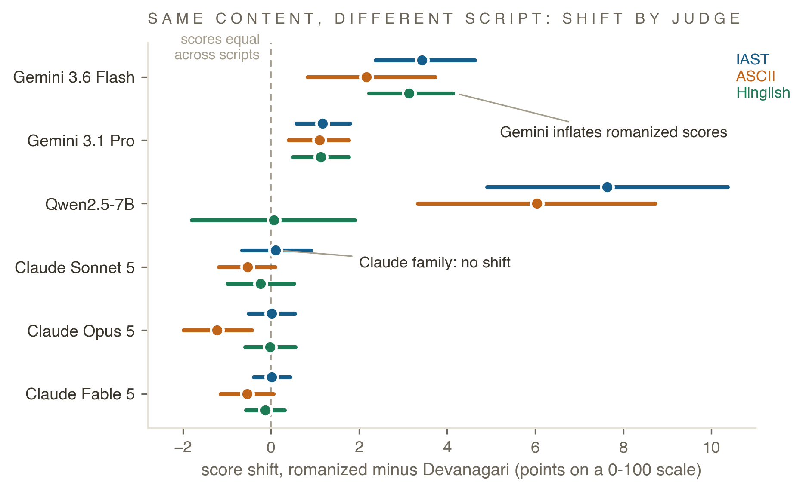

# Do LLM Judges Penalise the Script?

A script-controlled audit of LLM-as-judge scoring for Hindi written in Devanagari versus romanized orthographies.

LLM judges feed leaderboards, reward models, and production quality gates. All of that assumes the writing system of an answer does not move its score. We test that assumption directly. We hold content fixed and vary only the script: 150 Hindi instruction and response pairs at three quality tiers (high, medium, low), each rendered in native Devanagari and three romanizations (scholarly IAST, diacritic-stripped ASCII, and natural user-style Hinglish), scored blind by six judges from three model families.

We pre-registered the prediction that romanized text would score lower. The data reversed it.

## Findings

- **Gemini 3.6 Flash inflates romanized Hindi.** Identical content scores 2.2 to 3.4 points higher (on a 100-point scale) in romanized form than in Devanagari. The inflation concentrates at 6.5 to 7.8 points on medium-quality responses, where the judge has the most discretion.
- **The effect shrinks but survives at the frontier tier.** Gemini 3.1 Pro inflates romanized text by 1.1 points overall.
- **The bias changes shape at the open-weights tier.** Qwen2.5-7B inflates scholarly IAST by 7.6 points overall, rising to +17.8 on low-quality items, where the small judge loses the ability to detect bad content through formal romanization. Yet it is flat on natural Hinglish.
- **Claude judges are script-invariant.** Sonnet 5, Opus 5, and Fable 5 all stay within half a point across scripts, with one exception in our pre-registered direction: Opus 5 penalises diacritic-stripped ASCII by 1.2 points.
- **The obvious mitigation fails.** Instructing the judge to evaluate content regardless of script leaves the inflation intact.
- **Token length is ruled out as the mechanism.** Romanized Hindi costs 1.33 to 1.98 times the tokens of Devanagari, but per-item token inflation does not predict per-item score shift. The judge does perceive the script: 41 to 57 percent of its written rationales on romanized items mention the orthography, versus 1 percent on Devanagari.

Script bias in LLM judges is real, heterogeneous across judges in both size and sign, and cannot be instructed away. Which judge a practitioner picks silently changes how romanized-Hindi systems rank.



## Repository layout

```
paper/            paper.tex, paper.pdf, and the figure assets used in the build
experiments/      all experiment code and data
  dataset_conditions.json   the 150 items x 4 script conditions
  data_gen/                 tiered source responses (high, medium, low)
  hinglish/                 Hinglish rendering batches
  claude_packets/           blinded scoring packets and answer keys for the Claude judges
  run_gemini_judge.py       Gemini judge runner (also used for the mitigation arm)
  modal_qwen_judge.py       Qwen2.5-7B judge on Modal (logprob scoring)
  analyze.py                statistics; writes results/analysis.json
  render_conditions.py, cost_tracker.py
figures/          style.py, build_figures.py, and the five paper figures
results/          raw judge scores (jsonl), Claude packet scores (json), analysis.json,
                  token counts, and the API spend log
lit_review/       literature review (csv, markdown, raw search results)
site-sources/     HTML sources for the project pages
EXPERIMENT_PLAN.md, MILESTONES.md
```

## Reproducing the results

1. Create a `.env` file in the repository root containing your Gemini key (the file is gitignored):

   ```
   GEMINI_API_KEY=your-key-here
   ```

2. Run the Gemini judges (one call per item and condition, order randomized, no cross-item context):

   ```
   python3 experiments/run_gemini_judge.py --model gemini-3.6-flash
   python3 experiments/run_gemini_judge.py --model gemini-3.6-flash --mitigation
   python3 experiments/run_gemini_judge.py --model gemini-3.1-pro-preview
   ```

   The Qwen2.5-7B judge runs on Modal via `experiments/modal_qwen_judge.py`. The Claude judges were scored through blinded packets in `experiments/claude_packets/`.

3. Recompute the statistics and rebuild the figures:

   ```
   python3 experiments/analyze.py
   python3 figures/build_figures.py
   ```

   Every number in the paper comes from `results/analysis.json`.

## Cost

The full study cost under 5 US dollars in API spend (itemised in `results/spend_log.jsonl`) plus about one A10G GPU-hour on Modal for the Qwen judge.
